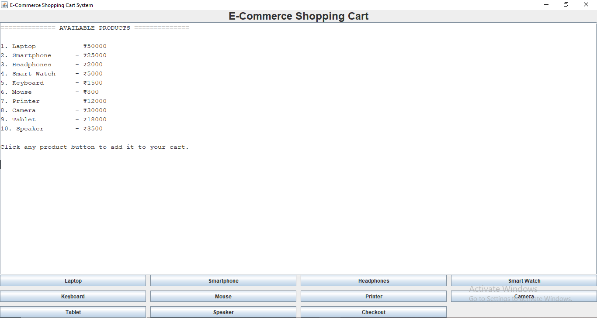
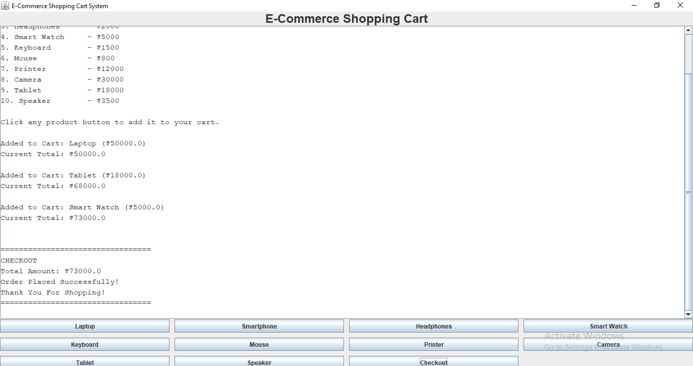

***Shopping Cart System (Java Swing)🛒***

A simple GUI-based Shopping Cart System built with Java Swing. The application displays products in a white-window interface, allows users to add products to a cart, keeps a running total, and performs checkout without using the console.

***Features***

- GUI-based shopping cart using Java Swing
- 10 predefined products
- Add products to cart with one click
- Running total calculation
- Checkout functionality
- All output shown inside the application window (no terminal interaction)
- Simple, beginner-friendly code structure

***Products Included***

Product| Price
Laptop| ₹50,000
Smartphone| ₹25,000
Headphones| ₹2,000
Smart Watch| ₹5,000
Keyboard| ₹1,500
Mouse| ₹800
Printer| ₹12,000
Camera| ₹30,000
Tablet| ₹18,000
Speaker| ₹3,500

***Technologies Used***

- Java
- Swing (GUI framework)
- AWT layouts and components

***File Structure***

ShoppingCartSystem.java
README.md

***How to Compile and Run***

Prerequisites

- JDK 8 or higher installed
- "javac" and "java" available in PATH

Compile

javac ShoppingCartSystem.java

Run

java ShoppingCartSystem

***Application Workflow***

1. Launch the application.
2. The white GUI window displays the product list.
3. Click any product button to add it to the cart.
4. The cart log and current total appear in the center display area.
5. Click Checkout to finalize the order.
6. The application displays:
   - Total Amount
   - Order Placed Successfully
   - Thank You For Shopping

***Sample Output (Inside the GUI Window)***

============== AVAILABLE PRODUCTS ==============

1. Laptop          - ₹50000
2. Smartphone      - ₹25000
3. Headphones      - ₹2000
4. Smart Watch     - ₹5000
5. Keyboard        - ₹1500
6. Mouse           - ₹800
7. Printer         - ₹12000
8. Camera          - ₹30000
9. Tablet          - ₹18000
10. Speaker        - ₹3500

Added to Cart: Laptop (₹50000)
Current Total: ₹50000

Added to Cart: Smartphone (₹25000)
Current Total: ₹75000

=================================
CHECKOUT
Total Amount: ₹75000
Order Placed Successfully!
Thank You For Shopping!
=================================

***Possible Future Enhancements***

- Quantity selection for each product
- Remove item from cart
- Product images
- Persistent cart storage
- Search and filter products
- Payment method simulation
- Database integration
- MVC architecture separation

  ***Screenshot***
  

***License***

This project is provided for educational and demonstration purposes.

***Author***

Swatishree Padhiary
